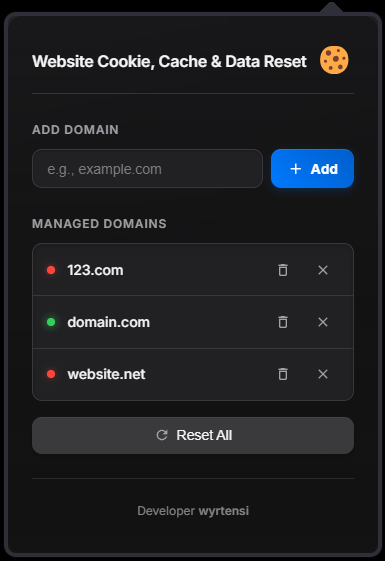

# Website Cookie, Cache & Data Reset Tool 🍪

A modern Chrome extension to easily manage and clear cookies, cache, and other site data for specific websites without affecting your entire browser data. Built with Manifest V3.

## Key Features

*   **Targeted Cleaning:** Clears Cookies, Cache Storage, Local Storage, IndexedDB, WebSQL, and Service Workers for specified domains (including `www.` subdomains).
*   **Domain Manager:** Easily add and remove domains you want to manage.
*   **Status Indicator:** Quickly see if cookies are present for managed domains (checks base domain and `www.`).
*   **Selective Reset:** Clear data for individual domains with a single click.
*   **Reset All:** Clear data for all managed domains simultaneously.
*   **Modern Dark UI:** Features a polished, premium dark theme with subtle animations and effects.
*   **Fun Emoji Button:** Click the cookie for a little wobble!

## Installation

Currently, this extension is not on the Chrome Web Store. To install it locally:

1.  **Download or Clone:** Get the extension files onto your computer.
2.  **Open Chrome/Edge/Opera Extensions:** Navigate to `chrome://extensions` in Chrome or `edge://extensions` in Edge, or `opera://extensions` in Opera.
3.  **Enable Developer Mode:** Toggle the "Developer mode" switch, usually found in the top-right corner.
4.  **Load Unpacked:** Click the "Load unpacked" button.
5.  **Select Folder:** Browse to and select the directory containing the extension's files (the folder with `manifest.json` inside).
6.  The extension icon should appear in your browser toolbar.

## Usage

1.  **Click the Extension Icon:** Open the popup window.
2.  **Add Domain:** Enter a base domain name (e.g., `example.com`) in the input field and click "Add" or press Enter.
3.  **Manage Domains:**
    *   The domain list shows managed sites.
    *   The colored dot indicates cookie presence (🟢 = Present, 🔴 = Absent, 🟡 = Error checking). Hover for details.
    *   Click the **Trash Bin icon** (🗑️) next to a domain to clear its cookies, cache, and site data.
    *   Click the **Cross icon** (❌) next to a domain to remove it from the managed list (does not clear data).
4.  **Reset All:** Click the "Reset All" button at the bottom to clear data for *all* domains currently in the list.
5.  **Click the Cookie:** Just for fun!

## Developer

Created by [wyrtensi](https://github.com/wyrtensi) 

## License

This project is licensed under the **MIT License**. See the [LICENSE](LICENSE) file for details. 
